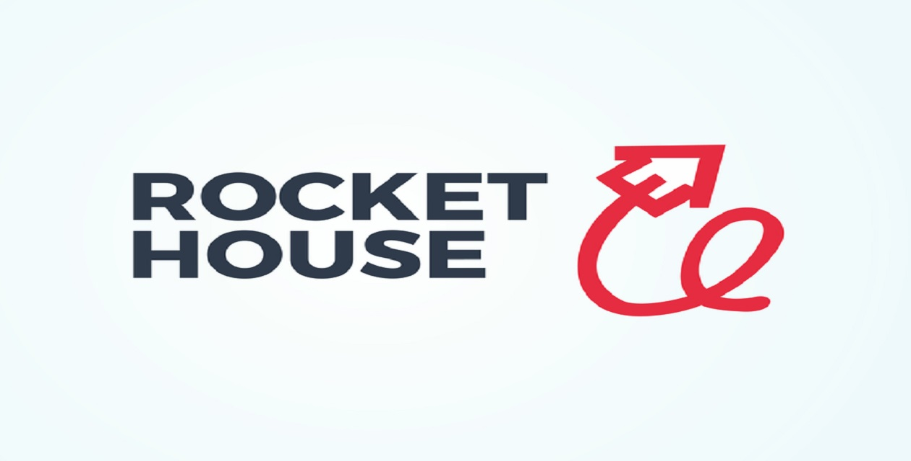

# House Rocket
  

# Problema de Negócio:
House Rocket é uma empresa fictícia, que compra e vende imóveis em Seattle. O principal objetivo da empresa é comprar boas imóveis com bons preços e depois vendê-las por preços mais altos. A empresa não possui um método para decidir quais imóveis devem ser compradas, e não possui um sistema de precificação para definir os preços de venda das imóveis.

Este projeto buscou responder as seguintes questões:

I) Quais são os imóveis que a House Rocket deveria comprar e por qual preço?

II) Uma vez o imóvel comprado, qual o melhor momento para vendê-lo e por qual preço?

# Premissas de Negócio:

* A empresa não definiu um número máximo de imóveis que quer comprar.

* Além de comprar e vender imóveis, a empresa também considera comprar imóveis que precisam ser reformadas.

# Estratégia de Negócio:

Etapa 01. Coleta de dados: Os dados foram coletados na plataforma Kaggle, como arquivo csv e baixados. O arquivo contém dados de imóveis em Seattle. A análise dos dados foi feita usando Python.

Etapa 02. Estatísticas de dados: os dados estatísticos foram calculados para identificar outliers e erros.

Etapa 03. Limpeza de dados: os dados que foram considerados erros de escrita foram removidos.

Etapa 04. Insights: Os atributos dos dados foram analisados a fim de identificar informações relevantes para o negócio.

Etapa 05. Identificar bons imóveis para compra: imóveis em excelentes condições, foram identificados como ótimos imóveis para a compra, e posteriormente para venda, gerando assim resultados rentáveis para a empresa.

Etapa 06. Precificação: Foi criado um app de visualização, dentro das condições estipuladas pelo time de negócio, onde é possível filtrar os imóveis por região (zipcode) e condições do imóvel (condition).

Etapa 07. Resultados: Através do aplicativo desenvolvido, é mostrado os imóveis com possíveis indicadores de compra, venda e lucro.

# Insights:

Hipótese 1 - Imóveis que possuem vista para água, são 30% mais caros, em média.

A hipótese é verdadeira. Imóveis que possuem vista para água são, em média, 212.64% mais caros.

Hipótese 2 - Imóveis com data de construção menor que 1955, são 50% mais baratos, em média.

A hipótese é falsa. Imóveis construídos antes do ano de 1955 são, em média, 0.79% mais baratos que os demais.

Hipótese 3 - Imóveis sem porão possuem área total 40% maior que os imóveis com porão.

A hipótese é falsa. Imóveis sem porão são, em média, 22.56% maiores que os demais.

Hipótese 4 - O crescimento do preço dos imóveis YoY ( Year over Year ) é de 10%.

A hipótese é falsa. O crescimento do preço dos imóveis entre os anos, é em média, 0.52% maior.

Hipótese 5 - Imóveis com nível elevado de design, em média, são mais caros.

A hipótese é verdadeira. Imóveis com nível elevado de design são 227.21% mais caros que os demais, em média.

***Para um Overview dos demais Insights de Negócio, clique no link localizado na aba "App" ao fim da página para uma melhor visualização.***

# Resultados:

O objetivo deste projeto era fornecer tabelas, visualizações que permitam identificar os imóveis com opções de compra e venda, e consequentemente o lucro máximo que poderá ser obtido se todas as transações acontecerem. Logo, o resultado financeiro apresentado abaixo representa o lucro máximo que poderá ser obtido.

| __Número de imóveis__ | __Lucro (profit)__   |
| --------------------- | ---------------------| 
|       10.579          | US$ 1.191.410.314.80 |

***O lucro pode ser explorado por condições e região dos imóveis, onde as visualizações fornecidas demonstram todo resultado do projeto, assim como o resultado financeiro.***

# Conclusões:

O projeto tem como fator principal, a geração de insights para o negócio, assim como responder algumas perguntas feitas pelo CEO. O objetivo foi concluído, junto com a extração de informações relevantes.

As visualizações fornecidas irão permitir com que a empresa possa avaliar as regiões mais lucrativas, além de identificar os atributos que levam o imóvel a se tornar mais viável para as operações de compra e venda.

# App:

O aplicativo a seguir, foi criado para uma melhor visualização dos dados.

https://lucas-penalva-streamlit-cloud-app-project-jgkgju.streamlitapp.com/

  

   
  
